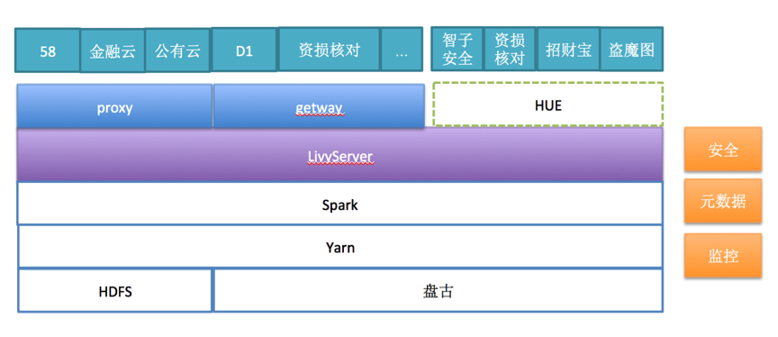

## Livy高可用与扩展性解决方案设计文档

## 背景
实时数仓，D1，主站都需要通过Livy接入，原生LivyServer存在不支持高可用和扩展性等问题，实时数仓会接入大量SparkSQL，因此需要在其落地前解决。


## Livy原理

[Livy原理](Livy原理篇.md)
## 存在的问题
* 高可用
    * 支持LivyServer挂掉能后恢复正在运行的Session，但停服务和恢复期间不能提供服务。
* 扩展性
    * LivyServer创建Session时需要启动Spark-submit进程，同时创建大量Session时会导致LivyServer机器OOM。
    * LivyServer启动Session后，需要维护Session与背后的APP，有线程、链接与内存的开销。

## 方案选择
* 方案1：使用VIP与ZK，实现主备
    * 通过ZK抢主，LivyServer启动后连ZK，抢锁，成功的为Active，继续后续的逻辑。未抢到锁则为standby，standby进入循环，不停的抢。
    * Active节点需要监控与ZK的链接，如果链接断开，则需要主动结束进程。
    * VIP，通过一个VIP背后绑定主备两个Livy，VIP会自动检测绑定的服务，并把请求转发给健康的服务。

    优点，实现简单，开发量少

    缺点，部署较复杂，依赖vip，扩展性需要额外设计

* 方案2：主主全量

    两个LivyServer同时提供服务，背后通过statestore同步，LivyServer把状态存储到statestore，并不停的从statestore获取session，并recovery到内存。

	优点，实现简单，开发量少

	缺点，扩展性需要额外设计

* 方案3：无状态
    考虑稳定性与扩展性，把LivyServer做成改成无状态，每个LivyServer都可以访问所有session，只有当访问LivyServer时，才会连接RscDriver。

    优点，同时考虑高可用和扩展性，新增和减少LivyServer方便简单，影响小。

    缺点，需要修改的代码较稍多。

### 需要解决的问题
```
1. SessionId如何保证唯一
2. LivyServerA上创建的Session可以在其他LivyServer上访问
3. StateStore保存的信息不足。
	  InteractiveRecoveryMetadata(
id, appId, appTag, kind, heartbeatTimeout.toSeconds.toInt, owner, proxyUser, rscDriverUri)
4. 单个LivyServer上维护的Session过多时需要断开链接，且不通知SparkAPP的运行
5.LivyServer需要重新连接到SparkAPP
6.心跳超时功能的支持，Session垃圾清理功能
7. Job同步状态功能
8. SparkAPP长时间无LivyServer连接会自动断开，默认10分钟
9. SparkServer还可能正在创建session过多问题
10. StateStore只有file和ZK，访问量会大增，性能问题
11. 防止任务一直处于Starting状态
```

对应的解决方法

```
1.	由递增整型数字改为UUID，保证唯一。
2.	LivyServer创建Session时需要把Session信息存储到StateStore，LivyServer接收到请求时，如果内存中不存在SessionId，则需要到StateStore中获取SessionInfo。
3.	需要新增State，开始于结束时间，心跳时间，appInfo等。
4.	LivyServer需要新增缓存Session功能，如果维护的Session个数超过配置值（默认1000），则断开，并且仅断开链接，不能Kill任务。
5.	只有State是running和idle状态才需重新连接到SparkAPP
6. 心跳时间维护在statestore，LivyServer定期扫描StateStore，清理超时的Session，清理结束的垃圾Session。
7. 希望通过RscDriver把结束的job和statement信息保存到StateStore，LivyServer访问StateStore获取。暂未实现。
8. 设置较长时间，让长时间不会断开
9. 增加创建过多reject的功能
10. 需要增加Database StateStore
```
### 还存在的问题
* 获取sessions的接口，获取from to之间的session
* Job同步状态功能
* 不支持client模式

### 附录
可以向livy提的patch

1.	Mysql statestore
2.	Livy Server增加Reject功能。
