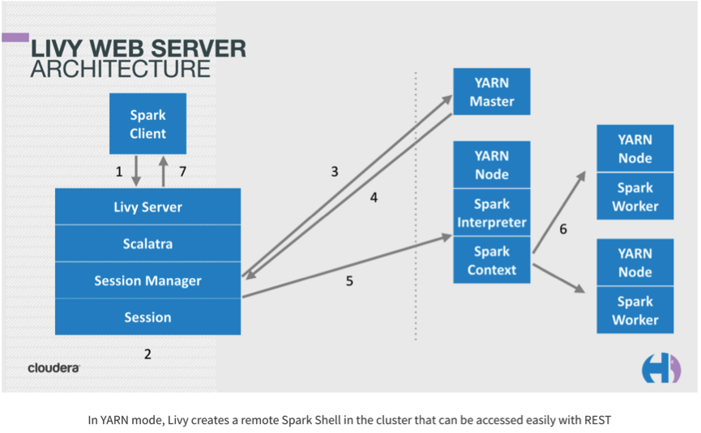
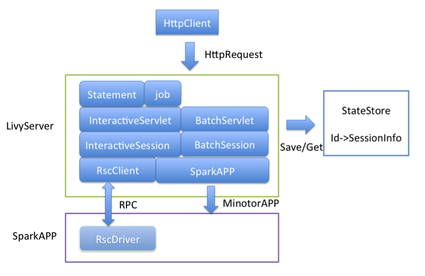
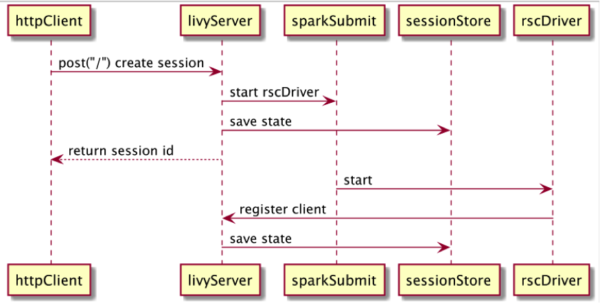
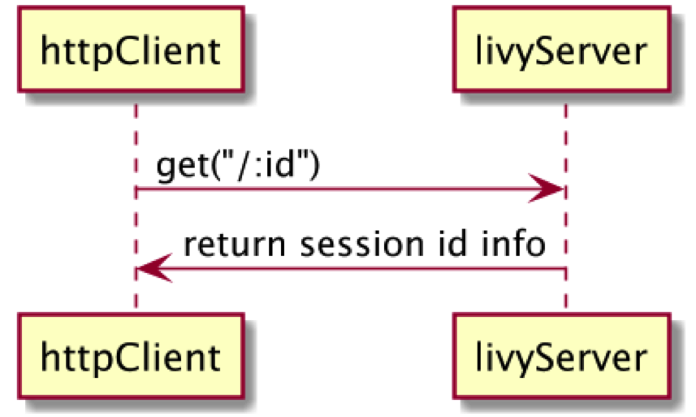
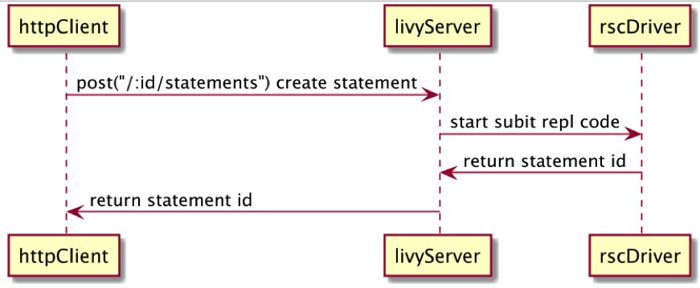
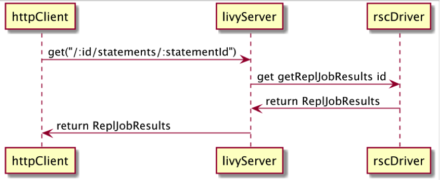
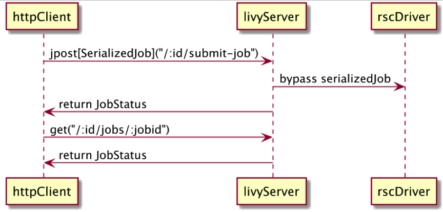
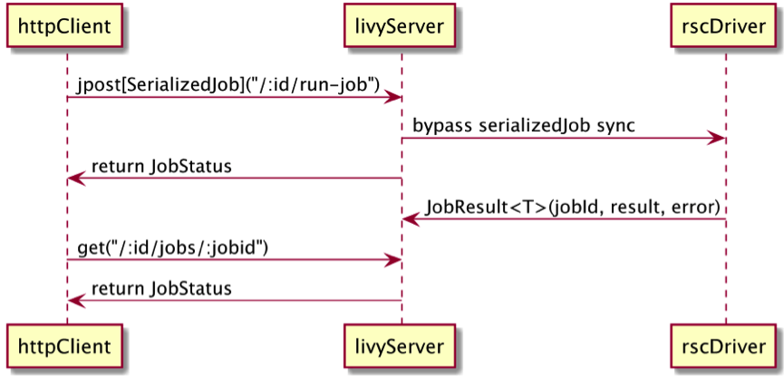

## Livy原理

### Livy介绍
Livy是一个提供rest接口和spark集群交互的服务。它可以提交spark job或者spark一段代码，同步或者异步的返回结果；也提供SparkContext的管理，通过Restfull接口或RPC客户端库。Livy也简化了与Spark与应用服务的交互，其他特点还包含：

* 长时间运行的SparkContext，允许多个spark job和多个client使用。
* 在多个spark job和客户端之间共享RDD和Dataframe
* 多个sparkcontext可以简单的管理，并运行在集群中而不是Livy Server，以此获取更好的容错性和并行度。
* 作业可以通过重新编译的jar、片段代码、或Java/Scala的客户端API提交。
* 源码开源

Livy集合了spark job server和Zeppelin的优点，并解决了spark job server和Zeppelin的缺点。下面是Livy与spark job server和Zeppelin的对比表格。

          --   | Spark job server | Zeppelin | Livy
--------------  |------------------|----------|----
是否支持jar包提交 | 支持              | 不支持    | 支持
是否支持代码段提交 | 不支持            | 支持      |支持
是否支持SparkContext重用与管理| 支持  | 支持重用，不能stop SparkContext | 支持
运行模式         |	Client          | Client   | Client/Cluster
多个SparkContext运行|	在同一个JVM，可能存在问题 | 运行在不同JVM | 运行在不同JVM
接口            |	RestFul          | RestFul/WebSocket | RestFul
SQL是否支持      | 不支持            |支持       | 不支持

### 架构

### Livy API
Rest API
http://livy.apache.org/docs/latest/rest-api.html

Programmatic API
http://livy.apache.org/docs/latest/programmatic-api.html

### Livy运行原理

1. Session相关的操作
* create session原理时序图

* get session时序图

* create statement时序图

* get statement时序图

* submit Job（异步执行Programma Job）时序图

* run(同步执行Programma Job) Job时序

2. Batch相关的操作
