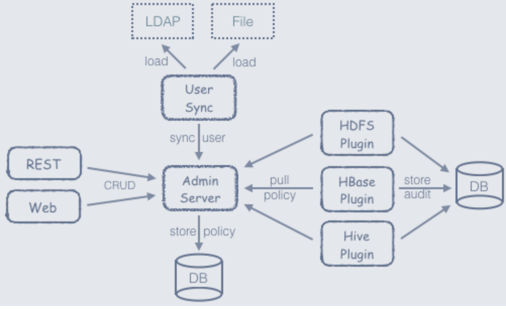
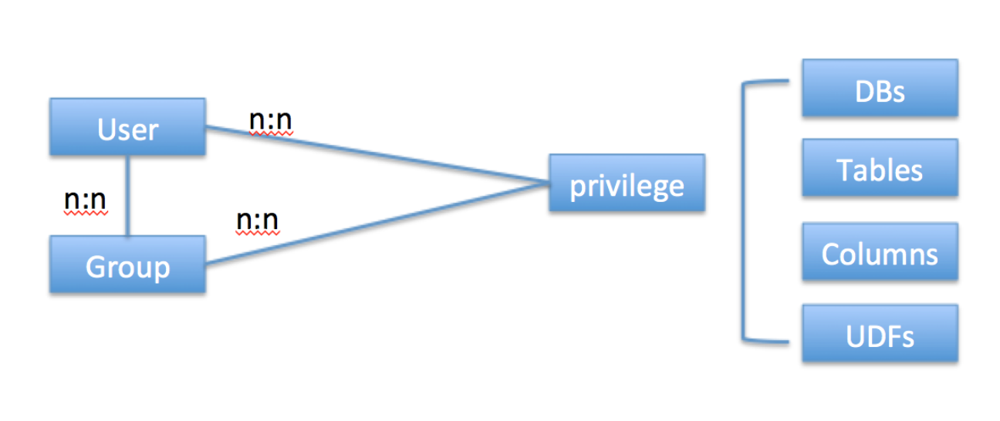

## Ranger鉴权
### Ranger架构



* AdminServer: 以RESTFUL形式提供策略的增删改查接口，同时内置一个Web管理页面。
* AgentPlugin: 嵌入到各系统执行流程中，定期从AdminServer拉取策略，根据策略执行访问决策树，并且定期记录访问审计。
* UserSync: 定期从LDAP/File中加载用户，上报给AdminServer。


### Ranger鉴权模型


Ranger中通过策略管理权限(Hive)
* 策略：包含资源（不同策略的资源不能相同），和一到多个策略子项。
* 资源：hive类型的资源有Database，Table，UDF，Column。
* 策略子项：List+ List + List


```
x_policy 策略表
x_policy_resource 策略对应资源信息
x_policy_resource_map 资源表

x_policy_item 策略子项

x_policy_item_access 策略子项对应权限表

x_policy_item_user_perm 策略子项对应用户表
x_user 用户表

x_policy_item_group_perm 策略子项对应组表
x_group 组信息表
```

### 优缺点
* 优点1，Ranger插件较多，包括HDFS，Yarn，Hive等。

* 缺点1，没有Role的概念，只有用户和组，权限直接和用户和组绑定，也无法支持hive/sparksql 中的grant，revoke等权限操作。
* 缺点2，权限为DBs，Tables，Columns的组合，权限匹配需要对所有策略做正则匹配。


## Hive鉴权
简化版本的brac模型，只针对hive本身的数据模型，后续不易扩展到其他非数据系统中，而且这个模型是被包含在sentry中的，hive的官方也推荐使用sentry来做外挂鉴权。

Hive鉴权包含SQL输入输出鉴权和Metastore的鉴权，其中

* hive.security.authorization.manager 是SQL解析后需要检测输入输出的权限，其中列权限输出的写权限在此实现。
* hive.metastore.pre.event.listeners 是Metastore中在所有操作前做鉴权的地方。
* hive.metastore.event.listeners是Metastore中完成操作后根据需要修改权限的地方，如create table后赋权owner。下面是Hive鉴权插件的实现类。

```
 hive.security.authorization.manager	org.apache.ranger.authorization.hive.authorizer.RangerHiveAuthorizerFactory		mod		create-if-not-exists
 hive.metastore.pre.event.listeners	org.apache.ranger.authorization.hive.authorizer.RangerHiveMetastoreAuthorizer		mod		create-if-not-exists
 hive.metastore.event.listeners		org.apache.ranger.authorization.hive.authorizer.RangerHiveMetastorePrivilegeHandler	mod		create-if-not-exists
```

### 优缺点
* 优点1，权限模型能方便支持各种权限操作，包括db，table，column，role，group，user，支持SQL操作权限。
* 缺点1，若基于Hive的鉴权，实现AntMetastore，等于全都需要自己开发。


## Sentry鉴权
[Sentry鉴权原理](Sentry鉴权原理.md)

### 优缺点
* 优点1，与Hive的鉴权类似，权限模型能方便支持各种权限操作，包括db，table，column，url，role，group，user，支持SQL操作权限。
* 优点2，Sentry已经实现了鉴权插件和数据管理等，基于Sentry开发AntMetastore的鉴权开发量比基于Hive鉴权的少。
* 优点3，符合标准的rbac权限模型， 符合后续标准数据权限的方向。
* 缺点1，Sentry插件较少，没有Yarn的插件。
