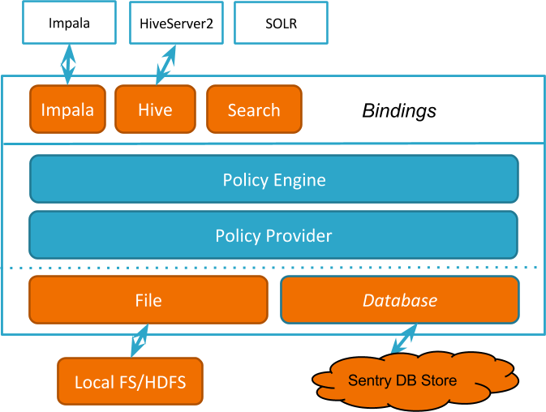
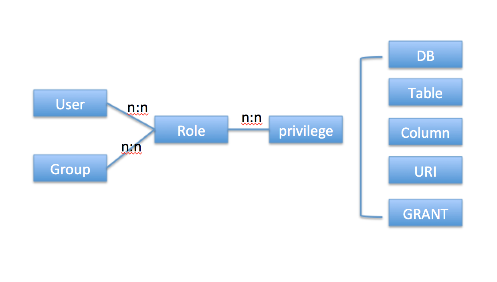
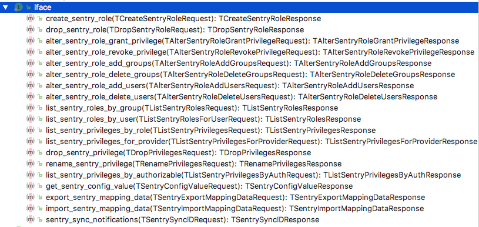

### Sentry架构

Sentry是Hadoop生态中的鉴权系统，2016年成为了Apache顶级项目。Sentry提供角色级别的数据权限访问，可以进行细粒度权限划分。例如，在Hive中，Sentry的SQL权限可以控制select等语句对DB、Table、View甚至数据列的访问。

下面是Sentry的架构。



* Binding

Binding实现了对不同的查询引擎授权，Sentry将自己的Hook函数插入到各SQL引擎的编译、执行的不同阶段。这些Hook函数起两大作用：一是起过滤器的作用，只放行具有相应数据对象访问权限的SQL查询；二是起授权接管的作用，使用了Sentry之后，grant/revoke管理的权限完全被Sentry接管，grant/revoke的执行也完全在Sentry中实现；对于所有引擎的授权信息也存储在由Sentry设定的统一的数据库中。这样所有引擎的权限就实现了集中管理。

* Policy Engine

这是Sentry授权的核心组件。Policy Engine判定从binding层获取的输入的权限要求与服务提供层已保存的权限描述是否匹配。

* Policy Provider

Policy Provider负责从文件或者数据库中同步权限。Policy Engine以及Policy Provider对于任何授权体系来说都是必须的，是公共模块，可服务于别的查询引擎。

### Sentry编译与安装

[Sentry编译与安装](Sentry编译与安装.md)

### Sentry鉴权模型与表结构
* Sentry Hive中基于角色的SQL鉴权模型



* Sentry存储在DB中的表结构

```
sentry权限表
| AUTHZ_PATH                        |
| AUTHZ_PATHS_MAPPING               |
| AUTHZ_PATHS_SNAPSHOT_ID           |
| SENTRY_DB_PRIVILEGE               |
| SENTRY_GM_PRIVILEGE               |
| SENTRY_GROUP                      |
| SENTRY_HMS_NOTIFICATION_ID        |
| SENTRY_PATH_CHANGE                |
| SENTRY_PERM_CHANGE                |
| SENTRY_ROLE                       |
| SENTRY_ROLE_DB_PRIVILEGE_MAP      |
| SENTRY_ROLE_GM_PRIVILEGE_MAP      |
| SENTRY_ROLE_GROUP_MAP             |
| SENTRY_ROLE_USER_MAP              |
| SENTRY_USER                       |
| SENTRY_VERSION                    |

权限表
MySQL [test]> describe  SENTRY_DB_PRIVILEGE;
+-------------------+---------------+------+-----+----------+-------+
| Field             | Type          | Null | Key | Default  | Extra |
+-------------------+---------------+------+-----+----------+-------+
| DB_PRIVILEGE_ID   | bigint(20)    | NO   | PRI | NULL     |       |
| PRIVILEGE_SCOPE   | varchar(32)   | NO   |     | NULL     |       |
| SERVER_NAME       | varchar(128)  | NO   | MUL | NULL     |       |
| DB_NAME           | varchar(128)  | YES  | MUL | __NULL__ |       |
| TABLE_NAME        | varchar(128)  | YES  | MUL | __NULL__ |       |
| COLUMN_NAME       | varchar(128)  | YES  | MUL | __NULL__ |       |
| URI               | varchar(4000) | YES  | MUL | __NULL__ |       |
| ACTION            | varchar(128)  | NO   |     | NULL     |       |
| CREATE_TIME       | bigint(20)    | NO   |     | NULL     |       |
| WITH_GRANT_OPTION | char(1)       | NO   |     | NULL     |       |
+-------------------+---------------+------+-----+----------+-------+

角色权限表
MySQL [test]> describe  SENTRY_ROLE_DB_PRIVILEGE_MAP;
+-------------------+--------------+------+-----+---------+-------+
| Field             | Type         | Null | Key | Default | Extra |
+-------------------+--------------+------+-----+---------+-------+
| ROLE_ID           | bigint(20)   | NO   | PRI | NULL    |       |
| DB_PRIVILEGE_ID   | bigint(20)   | NO   | PRI | NULL    |       |
| GRANTOR_PRINCIPAL | varchar(128) | YES  |     | NULL    |       |
+-------------------+--------------+------+-----+---------+-------+

```
### Sentry Server接口
Sentry Server提供了大量查询和修改权限的接口。


### Sentry Hive鉴权原理
Sentry的Hive插件基于HiveServer2，主要包括四个部分，分别是

* Hive Metastore中鉴权插件hive.metastore.pre.event.listeners
org.apache.sentry.binding.metastore.MetastoreAuthzBinding

* Hive Metastore中权限修改插件hive.metastore.event.listeners
org.apache.sentry.binding.metastore.SentryMetastorePostEventListener

  上面两个插件都是在Hive Metastore中，但Hive Metastore只能实现元数据的鉴权，对数据的鉴权无法实现，这需要在SQL引擎中实现。
* Hive SQL鉴权hive.server2.session.hook
org.apache.sentry.binding.hive.HiveAuthzBindingSessionHook

  HiveAuthzBindingSessionHook主要包括HiveAuthzBindingHook,它是hive.semantic.analyzer.hook，包括preAnalyze和postAnalyze，preAnalyze主要作用是获取SQL的DB和Table，语法树Analyze后，postAnalyze会对输入和输出做鉴权，这里还能实现对输入列级别的访问控制。

  第四个部分是SentryHiveAuthorizationTaskFactoryImpl，它实现了对角色的创建、赋权、回收权限等功能，接管了Hive的权限操作，实现权限的集中管理。
* hive.security.authorization.task.factory
org.apache.sentry.binding.hive.SentryHiveAuthorizationTaskFactoryImpl

### Sentry Hive如何获取input和output
Sentry实现了对输入列级别的鉴权，这首先需要获取SQL对应的输入和输出表，对于输入表还需要获取输入列信息。

1 在hive语法解析期间，需要记录下DB、Table，和操作类型（HiveOperation）。

2 语法解析期间，需要记下输入输出列表，用户。

3 语法解析完成后，需要通过HiveOperation获取stmtAuthObject，即语法鉴权对象，不同语法需要鉴权的内容定义在HiveAuthzPrivilegesMap中。

4 调用HiveAuthzBindingHookBase.authorizeWithHiveBindings，完成输入输出对象转换成Sentry所需的输入输出列表。

```
{Column=[SELECT], URI=[ALL], Table=[SELECT]}
[[Server [name=server1], Database [name=sensitive], Table [name=values__tmp__table__2]]]

{URI=[ALL], Table=[INSERT]}
[[Server [name=server1], Database [name=sensitive], Table [name=events]]]
```

5 调用HiveAuthzBinding.authorize，Query鉴权输入column->select, uri->select, table->select这三种类型的权限，然后和QUERY中的所有Input做一次循环匹配，生成request权限，输出也类似。然后调用authProvider.hasAccess判断用户是否有相应的request权限。

6 ResourceAuthorizationProvider.hasAccess,首先获取用户，组，Role对应的权限，然后针对Request权限，依次判断授权的权限，是否能符合，权限的匹配逻辑见CommonPrivilege.implies，即通用的权限匹配方式。原理如下：

```
需要的权限 Server=server1->Db=sensitive->Table=values__tmp__table__1->action=select
授权权限  [server=server1->db=sensitive->action=select]
```
首先从左到右，能否匹配，如果匹配不了，但授权权限的key是action，则可以继续，一直到action，最后判断action是否一样，一样则true，否则为false。


### Sentry Hive对View的处理
视图是一种特殊的表，视图实际没有物理存储的数据，它是基于其他已经存在的表通过视图对应的SQL生成的逻辑表。由于视图表底层对应了物理表，如果对视图赋权，而视图对应的物理表未被赋权，则也应该能访问视图对应的实际物理数据。

举例说明

```
  创建表和视图
  create table sensitive.events (
    ip STRING, country STRING, client STRING, action STRING
  ) ROW FORMAT DELIMITED FIELDS TERMINATED BY ',';

  create view filtered.events as select country, client, action from sensitive.events;

  把视图权限赋给角色，test_role，test属于test_role。未赋权sensitive.events给test_role。
  GRANT ALL ON DATABASE filtered TO ROLE test_role;
  GRANT ROLE test_role TO GROUP test;

  使用test用户执行SQL：
  $ beeline -u "jdbc:hive2://localhost:10001/" -n test -p test -d org.apache.hive.jdbc.HiveDriver

  可以查询视图，
  select * from filtered.events;
+-----------------+----------------+----------------+--+
| events.country  | events.client  | events.action  |
+-----------------+----------------+----------------+--+
| US              | android        | createNote     |
| FR              | windows        | updateNote     |
| US              | android        | updateNote     |
| FR              | ios            | createNote     |
| US              | windows        | updateTag      |
+-----------------+----------------+----------------+--+

  无权查询sensitive.events
  use sensitive;
  Error: Error while compiling statement: FAILED: SemanticException No valid privileges
 Required privileges for this query: Server=server1->Db=sensitive->Table=*->action=insert;Server=server1->Db=sensitive->Table=*->action=select; (state=42000,code=40000)
```

可以看到，通过视图赋权可以不需要物理表的权限。这在Hive中是如何实现的？由于视图在SQL执行前，会被优化成对应的实际物理表，逻辑计划中的视图操作会被清理掉。因此在Hive获取输入表信息时，会获取所有输入表（这里的表包括视图）的parent，在转换为Sentry的输入时，会判断表的parent是否为表，如果也是表，则不会鉴权该表，只有那些不存在parent为表的输入表才会鉴权，因此视图对应的实际物理表则不会被权限。
