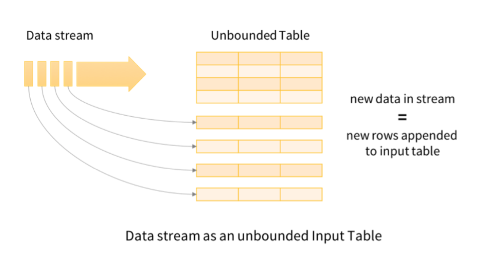
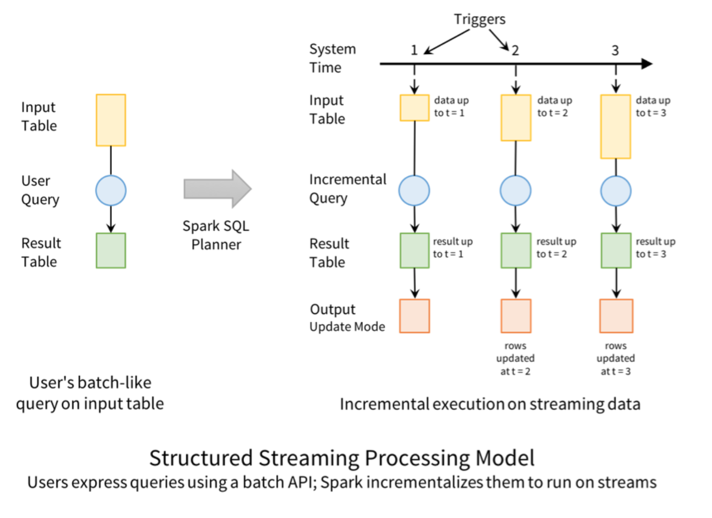
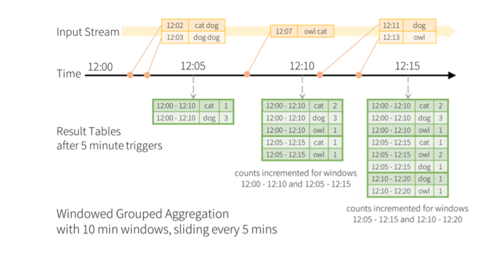
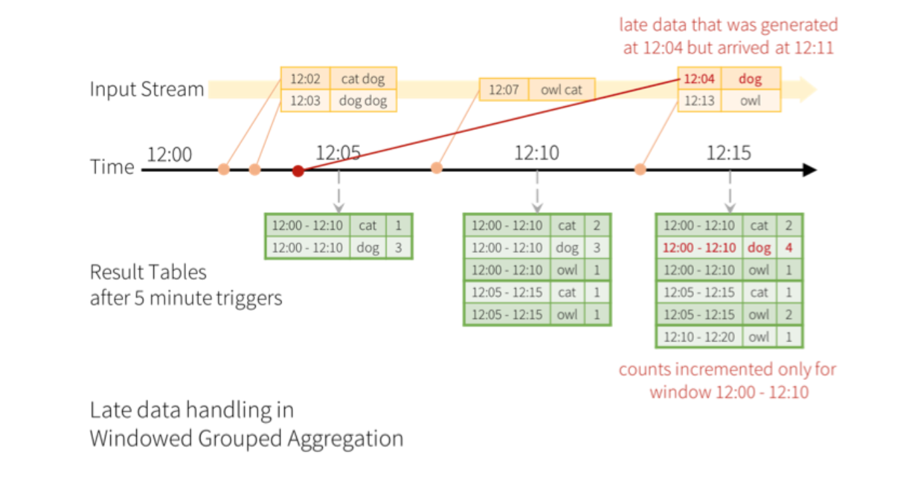
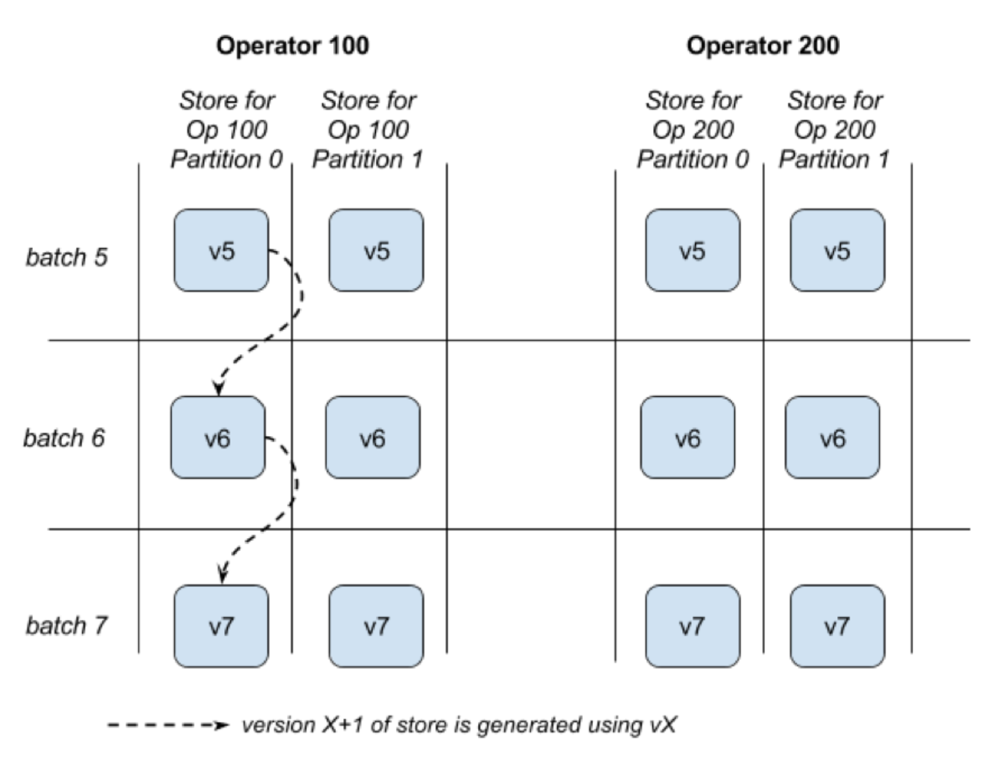

## 概述
Structured Streaming是一个建立在SparkSQL引擎之上可扩展的、容错的流处理引擎。它统一了批处理和流式计算接口，即可使用与批处理相同的方式来表示流计算。SparkSQL引擎负责增量和连续地运行，并随着流数据的到达更新最终的结果。它支持Scala、Java或Python中直接使用DataSet /DataFrame 接口实现流聚合，事件时间的窗口，流与批数据的Join等。此外，它还通过Checkpointing和WAL保证端到端的一致性和容错性。简而言之，Structured Streaming提供了快速、可伸缩、容错、端到端的精确流处理。

## 例子
### 流式的WordCount
下面使用一个例子来介绍Structured Streaming，一个流式的WordCount。  
首先需要初始化SparkSession对象，并初始化输入数据源，生成相应的DataFrame。

```
    val spark = SparkSession
      .builder
      .appName("StructuredNetworkWordCount")
      .getOrCreate()
    // Create DataFrame representing the stream of input lines from connection to host:port
    val lines = spark.readStream
      .format("socket")
      .option("host", host)
      .option("port", port)
      .load()
```

生成DataFrame后对数据进行处理，下面是WordCount的执行逻辑，对每一行使用空格做为分隔符，拆分成单词，然后对单词做GroupBy和Count，计算出不同单词的个数。
```
    // Split the lines into words
    val words = lines.as[String].flatMap(_.split(" "))
    // Generate running word count
    val wordCounts = words.groupBy("value").count()
```

定义了执行逻辑之后，需要启动流计算，下面是启动Structured Streaming的方法。
```
    // Start running the query that prints the running counts to the console
    val query = wordCounts.writeStream
      .outputMode("complete")
      .format("console")
      .start()
    query.awaitTermination()
```

从Spark 2.0开始，新的接口 DataSet(或DataFrame)替代了RDD。除了输入输出的不同，这套接口已经实现流式和批处理编程接口统一，即同一套代码只需要修改输出输出的代码，就可以运行在流式和批处理两种模式下。

## 原理详解
### 模型详情
从概念上理解，Structured Streaming会将所有流输入数据视为无界输入表。流中的每条新纪录都像附加在输入表上的一行。它并不会保留所有的输入，但却相当于在所有输入数据上做批处理得到的结果。如下图所示。



与静态表类似，开发人员在这个输入表上定义一个查询，计算最终的结果表，并被写到接收器（Sink）。Spark会自动将此批处理查询转换为流式计算，即增量执行，每一条记录到达后，Spark会计算出状态数据以更新结果；最后根据开发人员指定的触发器来控制何时更新结果。每次触发时，Spark会检查新数据（即输入表中的新行），并增量更新结果。下图是Spark批处理和流处理的对比。



### 事件时间的窗口操作
在此前的Spark版本中，Spark Streaming只支持处理系统时间（即Spark接收数据的时间），而不支持基于事件时间（即记录中的时间字段）的操作，这限制了其使用的范围，例如很多时候数据都会自带时间字段，而我们希望以数据中的时间字段做聚合等操作，而不是Spark Streaming接收到数据的时间。

Structured Streaming已经支持事件时间的操作。在这基础上，就可以实现事件时间窗口的聚合，比如每分钟的事件数，只需要对数据中的时间列做分组和聚合，并以一分钟窗口做为一个分组。举例说明，我们需要计算十分钟窗口内的单词个数，每5分钟更新一次。那么需要计算这些窗口单词数：12:00-12:10，12:05-12:15，12:10-12:20等。如果一个单词在12:07产生并在随后接收，则需要增加12:00-12:10，12:05-12:15的计数。如下图所示。



### 延迟数据与Watermarking
接着上面的例子，如果出现某个事件延迟，例如12:04产生的数据在12:11才接收到，这时候应该使用12:04的时间来更新12:00 -12:10这个窗口，而不是12:11。而且需要保存12:00 -12:10这个窗口的聚合数据，而不能在12:10后清理这个窗口数据。Structured Streaming可以在较长时间内保存部分聚集的状态信息，使得延迟数据能够正确地更新旧窗口的聚合，如下图所示。



随着运行时间的增长，中间状态信息会累积得越来越多，这就需要系统能定时清理过期数据，并且不再处理过期后到达系统的数据。实现这个功能就需要使用Watermarking，Watermarking类似于超时时间。系统能自动跟踪当前最新的事件时间，并根据Watermarking定义的阈值来清理过期数据，例如系统当前处理的最大的事件时间为T，此时系统会保持这个时间的状态，当延迟的事件时间超过T+Watermarking后，则将被丢弃。下面是使用Watermarking的例子。

```markup
importspark.implicits._

valwords=...

// streaming DataFrame of schema { timestamp: Timestamp, word: String }

// Group the data by window and word and compute the count of each group

valwindowedCounts=words

.withWatermark("timestamp","10 minutes")

.groupBy(

 window($"timestamp","10 minutes","5 minutes"),

 $"word")

.count()
```


上面的例子中，Watermarking被设置成10分钟，即中间状态信息保存10分钟，例如12:15到12:20之间接收的两条记录的事件时间为12:08与12:13，延迟都在10分钟内，因此会正常被接收和处理，但12:20到12:25接收的事件时间为12:04的记录则延迟超过10分钟，会被丢弃。使用Watermarking需要满足下面的条件：

1. 输出模式必须是Append或Update。 Complete模式需要保存所有聚合数据，不可以使用Watermarking删除中间状态。
2. 需要基于事件时间的聚合或基于事件时间的窗口。
3. Watermarking指定的列必须和聚合时间列相同，例如`df.withWatermark("time", "1 min").groupBy("time2").count()`是非法的, 因为watermark与聚合的列不同。
4. Watermarking必须在聚合前调用。如`df.groupBy("time").count().withWatermark("time", "1 min")`是非法的.


### 输出模式
Structured Streaming提供了三种输出模式：
* 追加（Append）：每个批次输出事件时间比（当前最新的事件时间-Watermarking）还小的记录。此模式适合结果表所在外部存储器不能更改的情况。
* 完整（Complete）：每个批次都会把整个结果表将被写到外部存储器。
* 更新（Update）：输出那些仅在本批次中修改的行，此模式适合可更新的外部存储器。


### 容错和存储系统
Structured Streaming能保证端到端的数据一致性，不过这需要对输入源和输出外部存储有如下两个需求：
1. 输入源必须是可重复的。即作业挂掉重启后，最近的数据需要重新订阅。例如Kafka的数据可重复订阅。它们只需保存几分钟的数据，Structured Streaming会自己保存所需的状态数据。
2. 输出外部存储必须支持事务的更新。当前Structured Streaming实现了此功能的外部存储有文件接收器，后续Spark还计划在数据库和键值存储中实现此功能。


除此之外，Structured Streaming还需要一个可靠的存储系统管理它的中间状态信息，如S3或HDFS。

#### 状态存储器
Structured Streaming在运行过程中，需要存储中间状态信息。Spark设计了StateStore，一个容错、key-value存储器，用于流式计算中多个小批量的计算和数据持久化。

接下来以聚合为例，把流聚合划分为固定数量的分区。针对每个分区，都会有一个状态存储来处理该分区的数据。另外，不同的聚合运算符ID也需要对应不同的状态存储。在流运行过程中，每个不同的批次还需要对应不同的版本，因此，每个状态存储还需要维护不同的版本。下面是状态存储的原理。



上图中，状态存储通过操作ID、分区ID、版本ID这三个ID标识。每个状态存储需要确保至少两个版本的数据可恢复，因为失败的后的重算最多需要参考之前的一个版本，比如当前正在处理第5个批次，那么第四个批次已经处理完成并持久化，版本4之前的数据已经不再需要，因此只需要维护版本4和5的状态存储即可。

另外状态存储会通过增量和快照的方式加速，在数据处理过程中，数据通过增量的方式更新，在后台通过异步的方式周期性的生成快照。

另外一个优化是使用StateStoreCoordinator优化调度，StateStoreCoordinator会追踪每个状态存储所在的Executor，在调度时会尽量把Task调度到其对应状态存储所在的Executor上。

### 交互查询
Structured Streaming可以通过Spark的JDBC服务器直接将结果暴露到交互式查询中。当前的版本中有一个基本的“memory”输出Sink，目的不是为大数据量设计的。但是，在将来的版本中，它允许将查询结果写入到内存的SparkSQL表中，并可直接运行查询。
```markup
// Save our previous counts query to an in-memory table
countsDF.writeStream.format("memory")
   .queryName("counts")
   .outputMode("complete")
   .start()
// Then any thread can query the table using SQL

sql("select sum(count) from counts where action=’login’")
```

### 不支持的操作
Structured Streaming现在还存在一些在流式计算中不支持的DataFrame/Dataset操作，主要包括下面几种情况。
1. 多个流的聚合（例如流DF上的聚合链）
2. Limit和获取前N条记录
3. 流式Datasets的Distinct操作
4. 只有输出模式为Complete的聚合后的排序操作才支持。
5. 流与静态数据的外连接有条件的支持
6. 流与静态数据的全外连接不支持
7. 右表为流式数据的左外连接不支持
8. 左表为流式数据的右外连接不支持
9. 双流join不支持（AntSpark版本已经支持）


此外还有一些Dataset 的方法也不支持，因为它们的行为会导致立刻运行查询并返回结果，这在流式Dataset 是没有意义的。
1. `count()` –不会返回一个值，使用`ds.groupBy.count()`会返回一个流式Dataset。
2. `foreach()` –使用`ds.writeStream.foreach(...)`
3. `show()` –应该使用sink


## **总结**
总的来说，Structured Streaming已经能满足大部分流式计算的需求，包括事件时间，状态保持，窗口，聚合与Join等功能都已经比较完善；而吞吐量大，流式与批处理编程统一则是Structured Streaming的两大优势。从spark 2.2.0版本开始，Structured Streaming正式成为稳定版本。后续社区也有计划将时效性从秒级提升到毫秒级。
